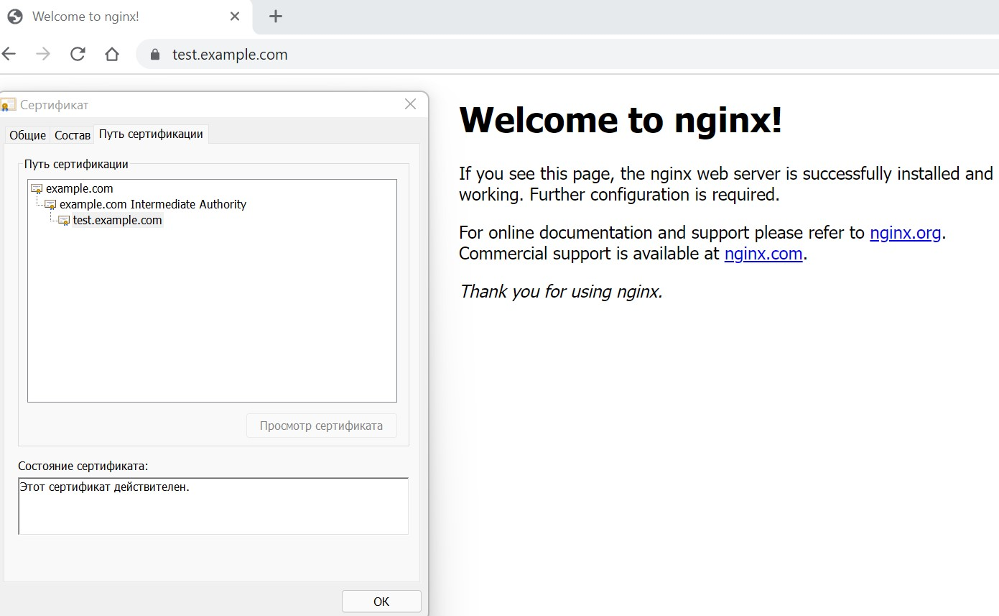

# Курсовая работа по итогам модуля "DevOps и системное администрирование"

Курсовая работа необходима для проверки практических навыков, полученных в ходе прохождения курса "DevOps и системное администрирование".

Мы создадим и настроим виртуальное рабочее место. Позже вы сможете использовать эту систему для выполнения домашних заданий по курсу

## Задание

1. Создайте виртуальную машину Linux.
2. Установите ufw и разрешите к этой машине сессии на порты 22 и 443, при этом трафик на интерфейсе localhost (lo) должен ходить свободно на все порты.
3. Установите hashicorp vault ([инструкция по ссылке](https://learn.hashicorp.com/tutorials/vault/getting-started-install?in=vault/getting-started#install-vault)).
4. Cоздайте центр сертификации по инструкции ([ссылка](https://learn.hashicorp.com/tutorials/vault/pki-engine?in=vault/secrets-management)) и выпустите сертификат для использования его в настройке веб-сервера nginx (срок жизни сертификата - месяц).
5. Установите корневой сертификат созданного центра сертификации в доверенные в хостовой системе.
6. Установите nginx.
7. По инструкции ([ссылка](https://nginx.org/en/docs/http/configuring_https_servers.html)) настройте nginx на https, используя ранее подготовленный сертификат:
  - можно использовать стандартную стартовую страницу nginx для демонстрации работы сервера;
  - можно использовать и другой html файл, сделанный вами;
8. Откройте в браузере на хосте https адрес страницы, которую обслуживает сервер nginx.
9. Создайте скрипт, который будет генерировать новый сертификат в vault:
  - генерируем новый сертификат так, чтобы не переписывать конфиг nginx;
  - перезапускаем nginx для применения нового сертификата.
10. Поместите скрипт в crontab, чтобы сертификат обновлялся какого-то числа каждого месяца в удобное для вас время.

## Результат

Результатом курсовой работы должны быть снимки экрана или текст:

- Процесс установки и настройки ufw
```bash
$ sudo apt-get install ufw              #установка
$ sudo ufw enable
  Command may disrupt existing ssh connections. Proceed with operation (y|n)? y
  Firewall is active and enabled on system startup
$ sudo ufw allow in on lo from 0.0.0.0/0    #разрешаем входящие подключения на localhost
$ sudo ufw allow 22                         #разрешаем входящие подключения по любому порту 22
$ sudo ufw allow 443                        #разрешаем входящие подключения по любому порту 443
$ sudo ufw status verbose
Status: active
Logging: on (low)
Default: deny (incoming), allow (outgoing), disabled (routed)
New profiles: skip

To                         Action      From
--                         ------      ----
Anywhere on lo             ALLOW IN    Anywhere                  
22                         ALLOW IN    Anywhere                  
443                        ALLOW IN    Anywhere                  
22 (v6)                    ALLOW IN    Anywhere (v6)             
443 (v6)                   ALLOW IN    Anywhere (v6) 
```
- Процесс установки и выпуска сертификата с помощью hashicorp vault  
для доступа использую vps
```bash
$ curl -fsSL https://apt.releases.hashicorp.com/gpg | sudo apt-key add -                                  #устанавливаем hashicorp vault
$ sudo apt-add-repository "deb [arch=amd64] https://apt.releases.hashicorp.com $(lsb_release -cs) main"
$ sudo apt-get update && sudo apt-get install vault

$ vault server -devvi -dev-root-token-id root                     #запускаем сервер vault в отдельной сессии

$ export VAULT_ADDR=http://127.0.0.1:8200                         #экспортируем переменные сред для адреса севрера хранилища и для проверки подлинности
$ export VAULT_TOKEN=root
$ vault secrets enable pki                                        #включем механизм pki
Success! Enabled the pki secrets engine at: pki/
$ vault secrets tune -max-lease-ttl=87600h pki                    #устаналиваем максимальное время выдачи сертификатов месяц
Success! Tuned the secrets engine at: pki/
$ vault write -field=certificate pki/root/generate/internal \     #создаем корневой сертификат, сохраняем как root_cert.crt
> common_name="example.coursework.com" \
> ttl=87600h > root_cert.crt

$ vault write pki/config/urls \                                   #настраиваем URL-адреса центра сертификации и CRL
> issuing_certificates="$VAULT_ADDR/v1/pki/ca" \
> crl_distribution_points="$VAULT_ADDR/v1/pki/crl"
Success! Data written to: pki/config/urls
$ vault secrets enable pki
Success! Enabled the pki secrets engine at: pki/
$ vault secrets tune -max-lease-ttl=87600h pki
Success! Tuned the secrets engine at: pki/
$ vault write -field=certificate pki/root/generate/internal \
>      common_name="example.com" \
>      ttl=87600h > CA_cert.crt
$ vault write pki/config/urls \
>      issuing_certificates="$VAULT_ADDR/v1/pki/ca" \
>      crl_distribution_points="$VAULT_ADDR/v1/pki/crl"
Success! Data written to: pki/config/urls
$ vault secrets enable -path=pki_int pki
Success! Enabled the pki secrets engine at: pki_int/
$ vault secrets tune -max-lease-ttl=43800h pki_int
Success! Tuned the secrets engine at: pki_int/
$ vault write -format=json pki_int/intermediate/generate/internal \
>      common_name="example.com Intermediate Authority" \
>      | jq -r '.data.csr' > pki_intermediate.csr
$ vault write -format=json pki/root/sign-intermediate csr=@pki_intermediate.csr \
>      format=pem_bundle ttl="43800h" \
>      | jq -r '.data.certificate' > intermediate.cert.pem
$ vault write pki_int/intermediate/set-signed certificate=@intermediate.cert.pem
Success! Data written to: pki_int/intermediate/set-signed
$ vault write pki_int/roles/example-dot-com \
>      allowed_domains="example.com" \
>      allow_subdomains=true \
max_ttl>      max_ttl="744h"
Success! Data written to: pki_int/roles/example-dot-com
```

- Процесс установки и настройки сервера nginx
```bash
$ sudo apt-get install nginx -y
$ sudo vi /etc/nginx/sites-available/default
server {
        listen 80 default_server;
        listen [::]:80 default_server;
        # SSL configuration
        listen 443 ssl default_server;
        listen [::]:443 ssl default_server;
        #
        root /var/www/html;
        # Add index.php to the list if you are using PHP
        index index.html index.htm index.nginx-debian.html;
        server_name test.example.com;
        ssl_certificate     /home/vagrant/ssl/test.example.com.crt;
        ssl_certificate_key /home/vagrant/ssl/test.example.com.key;
        ssl_protocols       TLSv1 TLSv1.1 TLSv1.2;
        ssl_ciphers         HIGH:!aNULL:!MD5;
```
- Страница сервера nginx в браузере хоста не содержит предупреждений 


- Скрипт генерации нового сертификата работает 

Скрипт генерации сертификата для nginx
```bash
$ sudo vi ~/script.sh

 #!/usr/bin/env bash
 vault write -format=json pki_int/issue/example-dot-com common_name="test.example.com" ttl="744h" > cert.json
 jq -r '.data.private_key' ./cert.json > ./ssl/test.example.com.key
 jq -r '.data.certificate' ./cert.json > ./ssl/test.example.com.crt

sudo service nginx restart
```
- Crontab работает (выберите число и время так, чтобы показать что crontab запускается и делает что надо)
```bash
vagrant@vagrant:~$ crontab -l
# Edit this file to introduce tasks to be run by cron.
# m h  dom mon dow   command
21 17 * * * /home/vagrant/script.sh >/dev/null 2>&1
$ grep CRON /var/log/syslog
...
Aug 14 17:21:01 vagrant CRON[641]: (vagrant) CMD (/home/vagrant/new_cert.sh >/dev/null 2>&1)
```
